

## The Code Challenge

### The Main Task

Please develop a small containerised product service with an HTTP API. We would love to see your working solution including tests, a local development environment, and some documentation.

The intended API can be interfaced via HTTP and should provide the following endpoints:

• GET /products
• POST /auth
• GET /user
• GET /user/products
• POST /user/products
• DELETE /user/products/{SKU}
(SKU meaning a unique product identifier in this and following context)

Users, products and previous purchases are provided as CSVs in the attached zip and need to be imported into the service once. For simplicity the user password is not hashed in the provided file.

The `/products` endpoint should return all available product data.

The API should offer some basic authentication to authenticate a specific user at the `/auth` endpoint. After a user is authenticated, the user should see user data (returns
name) at the `/user` endpoint, the purchased products at `/user/products` (returns SKU (unique product identifier) + name). It should be possible to attach or remove
purchased products to a particular user account.

## The Solution

### The FrameWork

Laravel is a web application framework with expressive, elegant syntax. We believe development must be an enjoyable and creative experience to be truly fulfilling. Laravel takes the pain out of development by easing common tasks used in many web projects, such as:

- [Simple, fast routing engine](https://laravel.com/docs/routing).
- [Powerful dependency injection container](https://laravel.com/docs/container).
- Multiple back-ends for [session](https://laravel.com/docs/session) and [cache](https://laravel.com/docs/cache) storage.
- Expressive, intuitive [database ORM](https://laravel.com/docs/eloquent).
- Database agnostic [schema migrations](https://laravel.com/docs/migrations).
- [Robust background job processing](https://laravel.com/docs/queues).
- [Real-time event broadcasting](https://laravel.com/docs/broadcasting).

Laravel is accessible, powerful, and provides tools required for large, robust applications.

### The Packages 

- "laravel/sail": "^1.0.1" - to use docker with laravel 
- "laravel/sanctum": "^2.11" - for authentication

## How to run the application?
ps:: .gitignore has been removed from this repo 
- download the repo on your local machine
- cd to the project 
- run the following commands:

 1- ./vendor/bin/sail up -d  (this may take a while for the first time, -d to run it in the background) - <b>Mandatory</b>
 
 2- ./vendor/bin/sail artisan migrate:refresh --seed (this command will build the database and add the data into the tables) - <b>Mandatory</b> 
 
 3- ./vendor/bin/sail test (to see all the positive and Negative Tests Implemented) - <b>Optional</b> 

## Test The Result On Postman

to test the result on postman, go to database -> data -> collection
import the collection to Postman and Check all the endpoints
- kindly notice that almost all the endpoints need authorization so the Bearer token must be correct

### About the Whole Process

#### The Database 
the database consists of 3 tables 

1- users

2- products

3- product_user (Pivot Table)

the purchased items from the CSV did not contain the primary key, however it did contain the SKUs instead.
so i made it according to the standard E-commerce frameworks where we link the products with their primary key and it must be integer, not a string ( we can however, make the primary key as a string but the standard way to be an integer)

#### The Data
the data will be imported from the CSV files once the command "seed" is run
  
#### Code Test
PHPUnit Test is used to run tests for each endpoint , Negative and Positive tests are added

## Different Cases
<b>Register</b>

All the different Cases of Registration has been processed

<b>Creating new User</b>

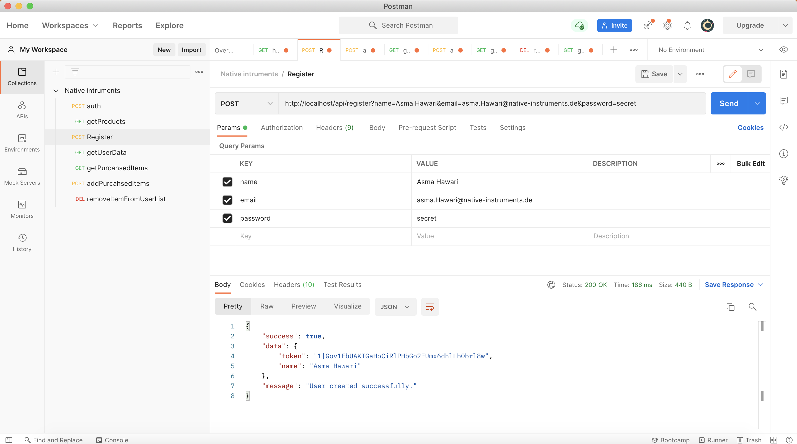

<b>Handing Validation Error</b>

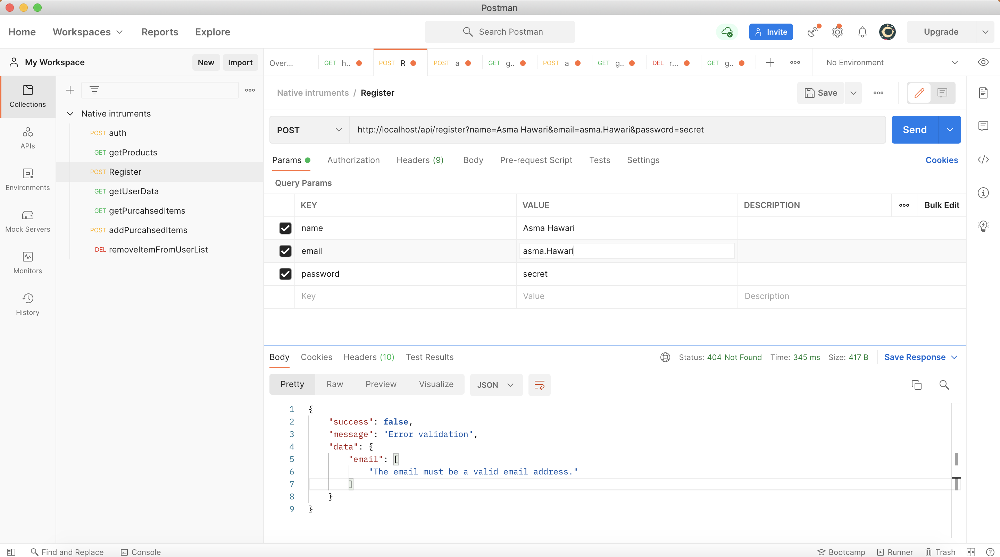

<b>Handing Duplicate Entry Error</b>

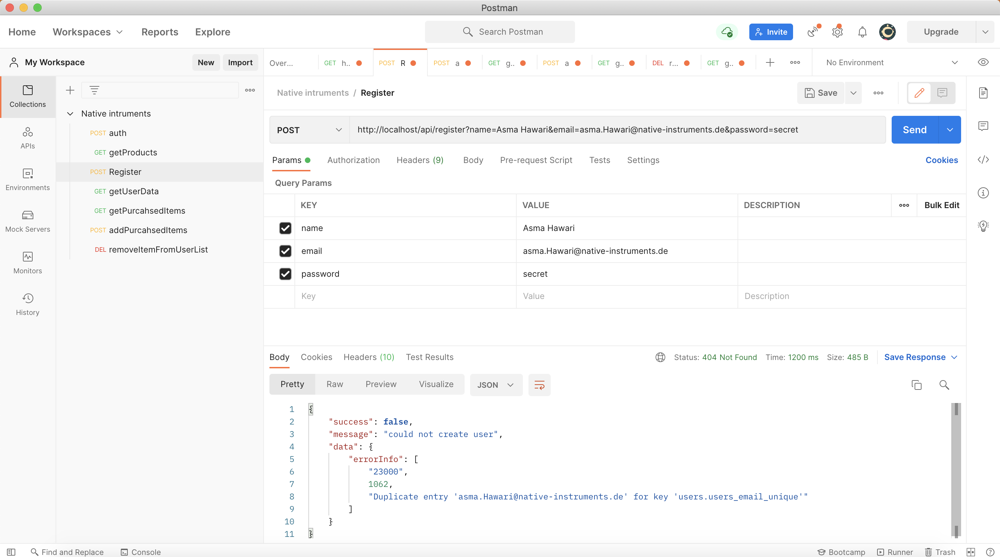

<b>Authentication</b>

All the different Cases of Authentication has been processed

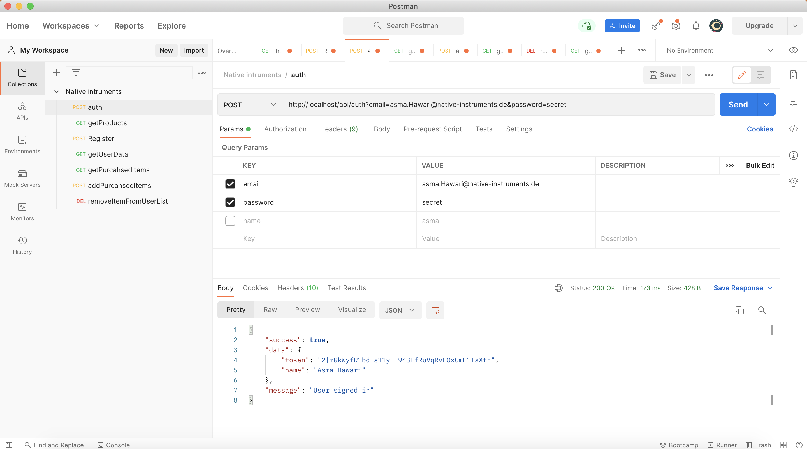

<b>Get Products</b>

Get All The products - No Authentication Required

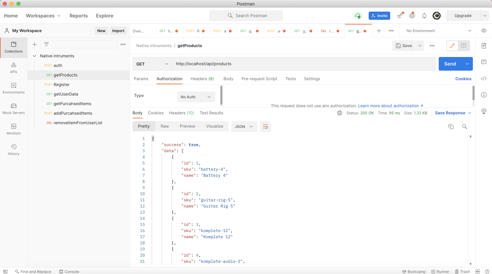

<b>Get User Data</b>

Get User name - Authentication Required

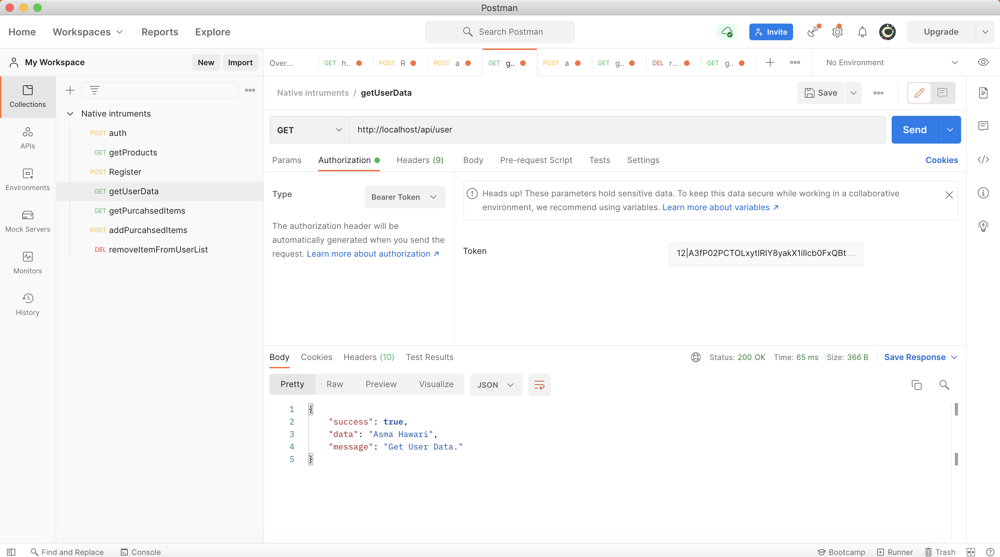

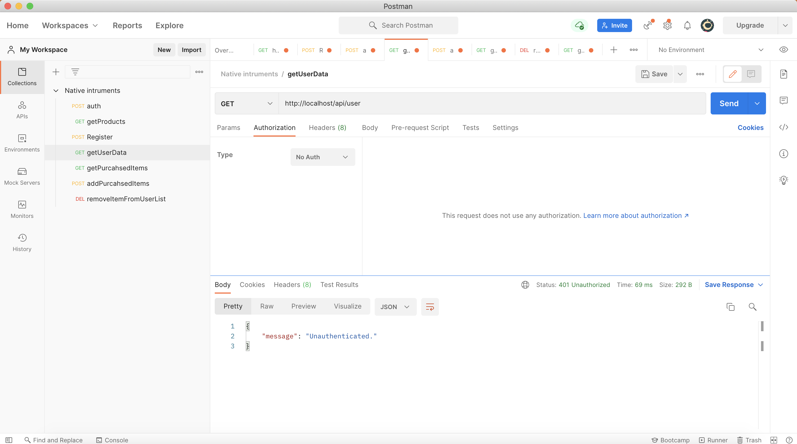

<b>Get User's Purchased Items</b>

SKUs for all the purchased products - Authentication Required

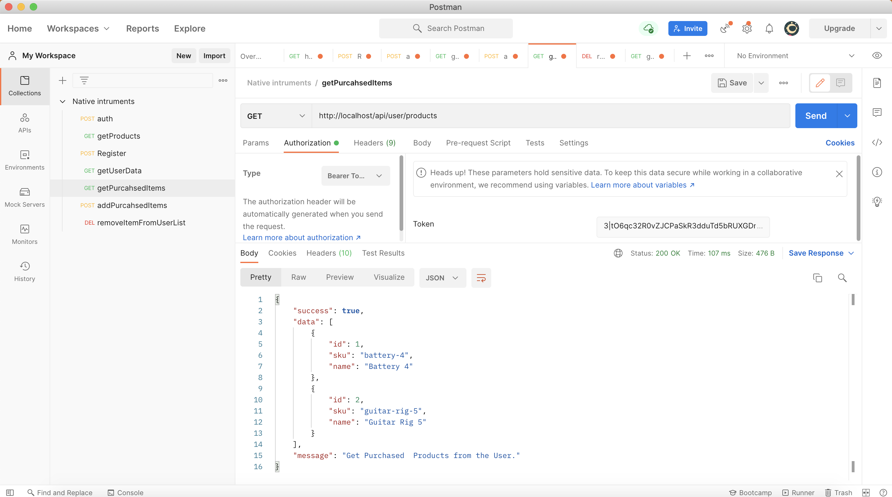

<b>Add Purchased Item to the user's purchased list</b>

SKU must be valid - Authentication Required

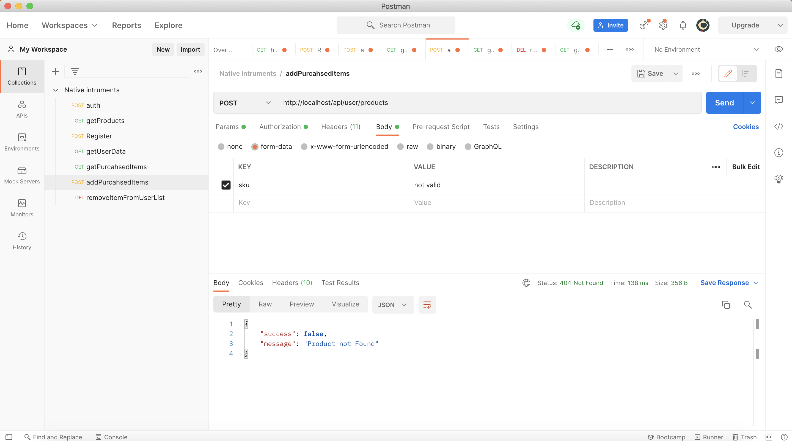

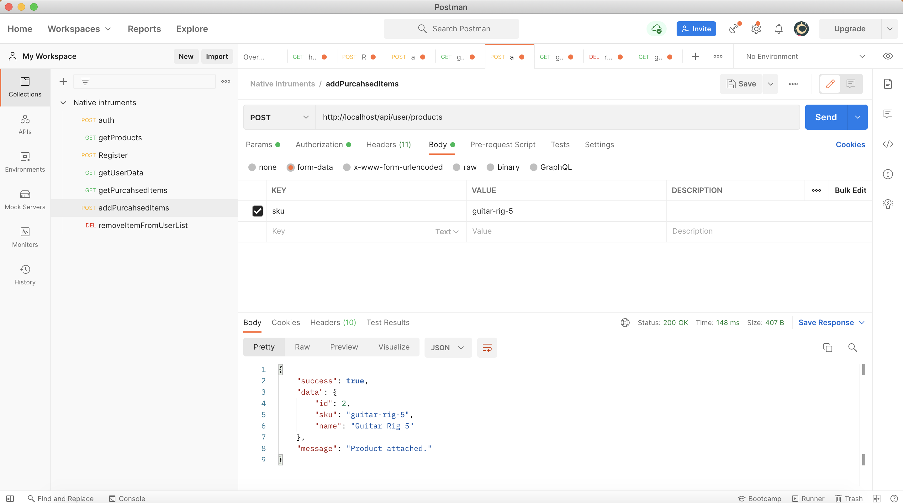

<b>Delete Purchased Item from the user's purchased list</b>

SKU must be valid - Authentication Required

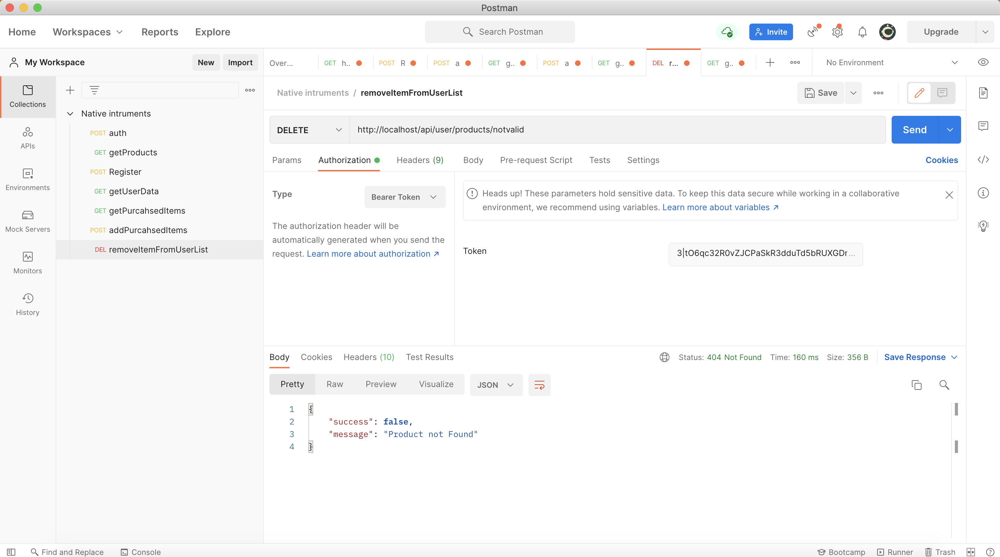

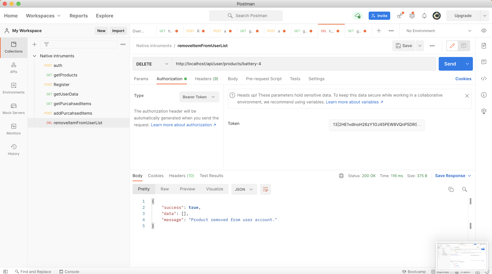

## suggested improvements
- Integrates with CI/CD processes on GitLab.
- Make use of the query string for filtering and pagination when retrieving all the products.
- make more tests to catch every exception that might be thrown.
- Add Tests For Database actions.
 
## License
The Laravel framework is open-sourced software licensed under the [MIT license](https://opensource.org/licenses/MIT).
